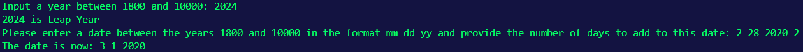

<h1>Mini Calendar using Math in C</h1>
 
<h3>Features</h3>
<ul>
    <li>Will be following the Gregorian Calendar which is the most commonly used calendar format</li>
    <li>Verify if a year is a Leap Year</li>
    <li>User Input</li>
    <li>Adding Days to a Given Date</li>
</ul>

<h2>Acknowledgments</h2>

<b>C: https://bit.ly/c-certification<b>
 

<h2>Photo</h2>

 

<h2>Contact</h2>

<b> Email: mariusc0023@gmail.com </b>
